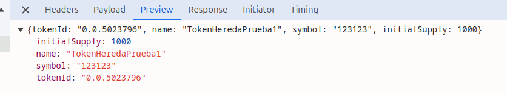

Bueno, en este proyecto esta todo lo requerido por la prueba propuesta, dando como resultado los 5 endpoints  requeridos

1 login:
este endpoint autentica al usuario y devuelve un token JWT que asigna en el local storage

2 logout:
este endpoint finaliza la sesion del usuario limpiando la local storage

3 register:
este enpoint registra un nuevo usuario y sigue los mismos pasos del login

4 create-token-hedera:
este crea un token con las especificaciones que pidieron, el cual qeuda asi

y el cual podemos verificar en la pagina de hereda que exista copiando el token id

5 list-tokens:

este endpoint deja en una lista solo los tokens que este usuario ha creado